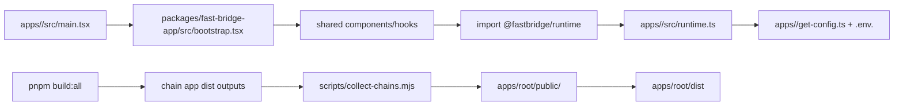

# Fast Bridge Architecture

This document explains how the monorepo is structured, how runtime configuration is injected, and which invariants keep multi-chain development maintainable.

## Goals

- Keep shared bridge logic in one place.
- Keep chain apps as thin runtime wrappers.
- Support chain-specific behavior without reintroducing copy-paste.
- Make adding new chains predictable and scriptable.

## Repository Layout

- `packages/fast-bridge-app`
Shared React app logic, components, hooks, and styles for all chains.

- `apps/<slug>`
Thin chain wrappers. Each app mostly provides:
  - `get-config.ts` (env-driven app config)
  - `src/runtime.ts` (`appConfig` + `chainFeatures` exports)
  - `src/main.tsx` (boots shared app)
  - chain-specific `public/` assets and `.env.<slug>`

- `apps/root`
Landing app that lists chains from `chains.config.json` and serves built bundles copied into `apps/root/public/<slug>`.

- `chains.config.json`
Registry of chains for scaffold/dev/build/root listing.

- `scripts/*`
Automation for env preparation, chain sync, chain scaffolding, dev orchestration, and bundle collection.

## Runtime Injection Model

Every chain app resolves shared imports with aliases in `apps/<slug>/vite.config.ts` and `apps/<slug>/tsconfig.app.json`:

- `@/*` -> `../../packages/fast-bridge-app/src/*`
- `@fastbridge/runtime` -> `./src/runtime.ts`

That means shared code can do:

```ts
import { appConfig, chainFeatures } from "@fastbridge/runtime";
```

and receive chain-specific values from the current app wrapper.

## Configuration Layers

### 1) Chain Registry (`chains.config.json`)

Used for:
- Root landing chain cards.
- `dev:all` dynamic package filtering.
- Scaffolding and sync scripts.

### 2) Env-driven App Config (`apps/<slug>/get-config.ts`)

Defines chain identity and brand values (IDs, RPCs, metadata, colors, logos, SEO metadata). Runtime source is `.env.<slug>` locally or `<SLUG>_` prefixed env vars in deployment.

### 3) Behavior Flags (`apps/<slug>/src/runtime.ts`)

`chainFeatures` controls behavior differences without forking shared logic (examples: promo banners, token logo overrides, post-bridge wallet actions, and chain-specific page/support content).

Source of truth for feature contract:
- `packages/fast-bridge-app/src/types/runtime.ts`

## Build and Env Flow

### Local and CI chain env preparation

- `scripts/prepare-env.mjs <slug>`
  - If `apps/<slug>/.env.<slug>` exists, copy to `.env.production` and `.env.local`.
  - Else read `<SLUG>_` prefixed process env vars and write stripped `VITE_*` keys.

### Multi-chain dependency/env sync

- `scripts/sync-chains.mjs`
  - Ensures `apps/root/package.json` has all `@fastbridge/<slug>` workspace devDependencies.
  - Updates `turbo.json` `globalEnv` from `.env.<slug>` keys (prefixed).

### Scaffold

- `scripts/chains-add.mjs`
  - Clones a template app (default: `monad`).
  - Renames package and scripts.
  - Adds chain entry to `chains.config.json`.
  - Runs `chains:sync` automatically.

### Build output composition

- `apps/root` build runs `scripts/collect-chains.mjs` before Vite build.
- `collect-chains` copies each chain `dist` into `apps/root/public/<slug>`.

### Deployment env export

- `scripts/build-vercel-env.mjs` aggregates `.env.<slug>` files into `<SLUG>_KEY=VALUE` lines for deployment systems.

## Key Invariants

- Shared logic belongs in `packages/fast-bridge-app/src/**`.
- Chain wrappers should stay thin. Prefer runtime flags over app forks.
- Runtime-imported image URLs can be root-relative (`/x.svg`) but should be normalized with `withBasePath(...)` in shared code paths.
- Tailwind must scan shared and wrapper sources:
  - `packages/fast-bridge-app/src/index.css` uses `@source` directives.
  - If files move, update these patterns.
- If `.env.<slug>` keys change, run `pnpm chains:sync`.

## Request/Build Flow Diagram



## Where to Go Next

- Chain onboarding details: `docs/adding-chains.md`
- Behavior customization playbook: `docs/customization.md`
- Agent operating conventions: `AGENTS.md`
