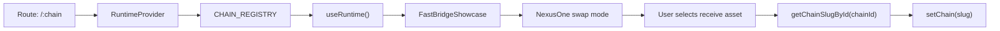

# Fast Bridge Architecture

This repository is currently a single Vite SPA. Chain-specific pages are runtime routes, not separate source apps.

## Goals

- Keep shared bridge and swap logic in one place.
- Keep chain wrappers out of the source model.
- Express chain differences through runtime config and feature flags.
- Make route-driven chain behavior predictable and easy to validate.

## Repository Layout

- `packages/fast-bridge-app/src`
  Shared React app, components, hooks, providers, styles, and route-aware runtime code.

- `packages/fast-bridge-app/src/config/chain-settings.ts`
  Source of truth for chain slugs, `appConfig`, `chainFeatures`, route metadata, Nexus chain IDs, and token defaults.

- `packages/fast-bridge-app/src/providers/runtime-context.tsx`
  Resolves the active route slug, exposes `appConfig`, `chainFeatures`, `chainSlug`, and `setChain()` through `useRuntime()`.

- `packages/fast-bridge-app/src/config/rpcs.json`
  Optional RPC configuration location when a chain uses shared RPC data outside the registry.

- `scripts/*`
  Build and route HTML generation helpers for the single SPA.

Existing `apps/**` folders are not the active source pattern for new work. Treat them as legacy/generated artifacts unless a task explicitly targets them.

## Runtime Model

`RuntimeProvider` reads the route parameter, validates it against `CHAIN_REGISTRY`, and redirects invalid routes to the last selected chain or `DEFAULT_CHAIN_SLUG`.

Shared code should read runtime values with:

```tsx
import { useRuntime } from "@/providers/runtime-context";

const { appConfig, chainFeatures, chainSlug, setChain } = useRuntime();
```

Shared components must not import static chain data directly when behavior depends on the active route.

## Configuration Layers

### 1) Chain Registry

Location:
- `packages/fast-bridge-app/src/config/chain-settings.ts`

Used for:
- Route slugs.
- Chain identity and metadata.
- RPC and explorer URLs.
- Nexus network and destination chain IDs.
- Primary token defaults.
- Chain-specific feature flags.

### 2) Feature Contract

Location:
- `packages/fast-bridge-app/src/types/runtime.ts`

`ChainFeatures` defines optional behavior differences. `defaultChainFeatures` must include safe fallbacks for new flags.

### 3) Shared Consumers

Location:
- `packages/fast-bridge-app/src/**`

Shared consumers must use `useRuntime()` and feature flags instead of hardcoded slug branches when a reusable flag is practical.

## Bridge UI Flow

The app shell renders `FastBridgeShowcase`, which hosts the active bridge/swap element. The current integration uses NexusOne in `swap` mode and derives its receive-side prefill from the active route:

- `/megaeth` selects USDM on MegaETH.
- `/citrea` selects ctUSD on Citrea.
- Other routes prefer USDC when Nexus supports USDC on that chain.

When a user manually changes the receive asset to another supported chain, the showcase maps the selected receive asset's `chainId` back to a route slug with `getChainSlugById()` and calls `setChain(slug)`.

## Key Invariants

- Shared logic belongs in `packages/fast-bridge-app/src/**`.
- Chain configuration belongs in `CHAIN_REGISTRY`.
- Do not use environment variables for chain-specific features.
- Do not rely on Turborepo multi-build wrappers for new source work.
- Route changes should preserve user-selected receive assets when the selection itself caused the route change.
- Registry-imported UI may need local import path fixes, but shared provider/config behavior should stay centralized.

## Request Flow Diagram


```mermaid
flowchart LR
  A["Route: /:chain"] --> B["RuntimeProvider"]
  B --> C["CHAIN_REGISTRY"]
  C --> D["useRuntime()"]
  D --> E["FastBridgeShowcase"]
  E --> F["NexusOne swap mode"]
  F --> G["User selects receive asset"]
  G --> H["getChainSlugById(chainId)"]
  H --> I["setChain(slug)"]
```

## Where to Go Next

- Chain onboarding details: `docs/adding-chains.md`
- Behavior customization playbook: `docs/customization.md`
- Agent operating conventions: `AGENTS.md`
