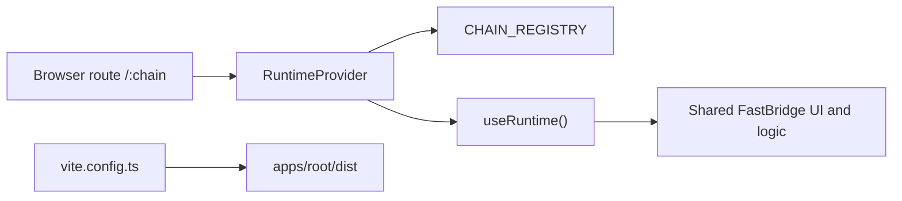

# FastBridge Architecture

FastBridge is a single Vite SPA with route-selected chain configuration. Every chain uses the same application bundle and shared component tree.

## Runtime Flow

1. `packages/fast-bridge-app/src/main.tsx` calls `bootstrapApp()`.
2. `packages/fast-bridge-app/src/bootstrap.tsx` defines the landing, support, and `/:chain` routes.
3. `RuntimeProvider` validates the route slug and reads its entry from `CHAIN_REGISTRY`.
4. Shared components read `appConfig` and `chainFeatures` through `useRuntime()`.
5. Changing the active destination updates the route and therefore the runtime configuration.

```mermaid
flowchart LR
  A["Browser route /:chain"] --> B["RuntimeProvider"]
  B --> C["CHAIN_REGISTRY"]
  B --> D["useRuntime()"]
  D --> E["Shared FastBridge UI and logic"]
  F["vite.config.ts"] --> G["apps/root/dist"]
```

## Source Layout

- `packages/fast-bridge-app/src/**`: shared UI, SDK integration, hooks, providers, and styles.
- `packages/fast-bridge-app/src/config/chain-settings.ts`: chain identity, branding, destination defaults, and behavior flags.
- `packages/fast-bridge-app/src/config/rpcs.json`: RPC configuration when a registry entry consumes it.
- `packages/fast-bridge-app/src/types/runtime.ts`: `AppConfig`, `ChainFeatures`, and their defaults.
- `packages/fast-bridge-app/src/providers/runtime-context.tsx`: route-to-runtime resolution.
- `vite.config.ts`: the single root build, with `@` aliased to the shared source directory.
- `apps/root/dist`: generated production output; it is not a separate application source tree.

Legacy directories under `apps/` may remain for history or generated output, but they are not the active chain-wrapper architecture.

## Configuration Layers

### AppConfig

Defines chain identity and presentation: chain ID, RPC, explorer, native currency, logos, colors, metadata, and the preferred Nexus destination token.

### ChainFeatures

Defines behavior differences such as supported tokens, limits, token-logo overrides, fee presentation, wallet timing, and optional chain-specific UI.

When a new behavior difference is required, extend `ChainFeatures`, add a safe fallback in `defaultChainFeatures`, consume it in shared code through `useRuntime()`, and set it only on the relevant registry entries.

## Invariants

- Shared logic belongs in `packages/fast-bridge-app/src/**`.
- Chain-specific data belongs in `CHAIN_REGISTRY`; do not add chain-specific environment variables.
- Shared components must use `useRuntime()` instead of static runtime imports.
- Route, token, amount, recipient, or chain changes must invalidate stale intents before requesting a new quote.
- Runtime image paths must remain valid from the root-hosted SPA.
- A production change must pass `pnpm check` and `pnpm build`.
