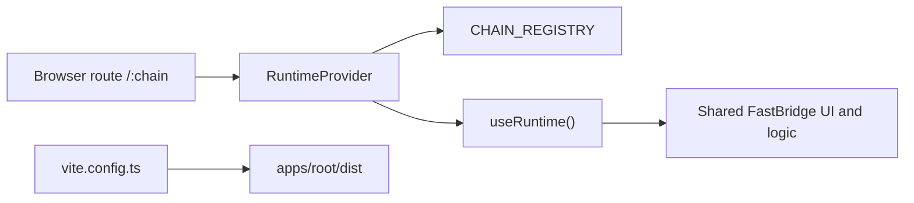

# FastBridge Architecture

FastBridge is a single Vite SPA with route-selected chain configuration. Every chain uses the same application bundle and shared component tree.

## Runtime Flow

1. `packages/fast-bridge-app/src/main.tsx` calls `bootstrapApp()`.
2. `packages/fast-bridge-app/src/bootstrap.tsx` defines the landing, support, and `/:chain` routes.
3. `RuntimeProvider` validates the route slug and reads its entry from `CHAIN_REGISTRY`.
4. Shared components read `appConfig` and `chainFeatures` through `useRuntime()`.
5. Changing the active destination updates the route and therefore the runtime configuration.

```mermaid
flowchart LR
  A["Browser route /:chain"] --> B["RuntimeProvider"]
  B --> C["CHAIN_REGISTRY"]
  B --> D["useRuntime()"]
  D --> E["Shared FastBridge UI and logic"]
  F["vite.config.ts"] --> G["apps/root/dist"]
```

## Source Layout

- `packages/fast-bridge-app/src/**`: shared UI, SDK integration, hooks, providers, and styles.
- `packages/fast-bridge-app/src/config/chain-settings.ts`: chain identity, branding, destination defaults, and behavior flags.
- `packages/fast-bridge-app/src/config/rpcs.json`: RPC configuration when a registry entry consumes it.
- `packages/fast-bridge-app/src/types/runtime.ts`: `AppConfig`, `ChainFeatures`, and their defaults.
- `packages/fast-bridge-app/src/providers/runtime-context.tsx`: route-to-runtime resolution.
- `vite.config.ts`: the single root build, with `@` aliased to the shared source directory.
- `apps/root/dist`: generated production output; it is not a separate application source tree.

Legacy directories under `apps/` may remain for history or generated output, but they are not the active chain-wrapper architecture.

## Configuration Layers

### AppConfig

Defines chain identity and presentation: chain ID, RPC, explorer, native currency, logos, colors, metadata, and the preferred Nexus destination token.

### ChainFeatures

Defines behavior differences such as supported tokens, limits, token-logo overrides, fee presentation, wallet timing, and optional chain-specific UI.

When a new behavior difference is required, extend `ChainFeatures`, add a safe fallback in `defaultChainFeatures`, consume it in shared code through `useRuntime()`, and set it only on the relevant registry entries.

## Invariants

- Shared logic belongs in `packages/fast-bridge-app/src/**`.
- Chain-specific data belongs in `CHAIN_REGISTRY`; do not add chain-specific environment variables.
- Shared components must use `useRuntime()` instead of static runtime imports.
- Route, token, amount, recipient, or chain changes must invalidate stale intents before requesting a new quote.
- Runtime image paths must remain valid from the root-hosted SPA.
- A production change must pass `pnpm check` and `pnpm build`.

## Balances and transfer UI

- `components/nexus/balance-utils.ts` normalizes both SDK balance APIs. Display wallet holdings from `totalBalance`; use `usableBalance` for inputs, percentages, MAX, source allocation, and quote validation. The UI token option's legacy `balance` field always means usable funds.
- SDK `value` describes usable funds in USD. Display USD totals use the corresponding unit price and total holding, with cached rates as a fallback. Token amounts retain decimal precision through aggregation.
- Single-mode direction reversal swaps both tokens and chains and keeps the source input's amount and token/USD mode. It clears the old receive amount, cached USD value, percentage and quote, then validates the retained input against the new source's usable balance. A retained source amount drives an exact-input quote. Unified or incomplete selections cannot be reversed.
- Done after either success or failure clears amounts, percentages and quotes. Single mode keeps both token selections; multi mode keeps the destination and clears sources.
- `lib/user-facing-error.ts` supplies readable reasons for receipts, alerts and connection errors. It strips sensitive payloads and developer diagnostics. An unknown transaction status is not proof of a refund or of funds being in a wallet.

## SDK progress handling

Progress handling uses the original behavior from `1044a8e`, before the September 9 feedback changes, with Nexus SDK `2.4.1`.

- `plan_preview` and `plan_confirmed` seed the progress list; the confirmed plan supplies the final raw steps.
- `plan_progress` uses the original step mapping and matching rules. Completed, confirmed, and success states advance the main progress list.
- The approval row advances on submission as well as confirmation, including the original `tx_sent` state. This row represents wallet actions; it does not declare the whole swap successful.
- SDK callbacks update progress directly. Standalone `execute()` uses the SDK directly without app-generated progress events.
- The operation result or rejection determines the final app outcome. Sanitized failure messages and the other balance and selection fixes remain in place.

Run `pnpm test:feedback` for balance, selection, error, SDK emitter and progress-row regressions. The SDK tests exercise the actual installed bridge/swap event mappers; the test adapter fails if their implementation markers change. These checks do not submit live wallet transactions.
